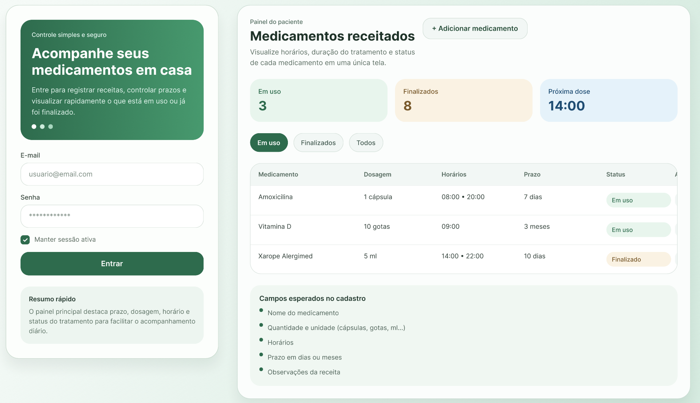

# Gestão de Medicação API

API REST em JavaScript para controle de medicamentos receitados para uso em casa. O projeto foi organizado em camadas (`routes`, `controllers`, `services` e `models`), utiliza Express, autenticação JWT, banco em memória, documentação Swagger e testes com Mocha, Supertest e Chai.

# Protótipo de Frontend:





## Proposta funcional
- Cadastro e login de usuário com JWT.
- Cadastro de medicamentos com nome, quantidade, unidade, horarios, prazo e observações.
- Listagem e filtro por status `em_uso` e `finalizado`.
- Finalização manual ou automática do tratamento conforme o prazo informado.
- Swagger em interface visual e em JSON.

## Estrutura do projeto
```text
src/
  app.js
  server.js
  routes/
  controllers/
  services/
  models/
  middlewares/
resources/
  epic-user-stories.md
  swagger.json
test/
  auth/
  medications/
  docs/
```

## Como executar
1. Instale as dependencias:
```bash
npm install
```

2. Inicie a API:
```bash
npm start
```

3. Execute os testes:
```bash
npm test
```

## Endpoints principais
- `POST /auth/register`
- `POST /auth/login`
- `GET /medications`
- `GET /medications/:id`
- `POST /medications`
- `PUT /medications/:id`
- `PATCH /medications/:id/status`
- `DELETE /medications/:id`
- `GET /docs`
- `GET /docs/json`

## Regras de autenticação
- O token JWT deve ser enviado no header `Authorization` no formato `Bearer <token>`.
- Endpoints de medicamentos exigem autenticação.
- Cada usuário acessa apenas os seus próprios medicamentos.

## Swagger
- Interface: `http://localhost:3000/docs`
- JSON: `http://localhost:3000/docs/json`

